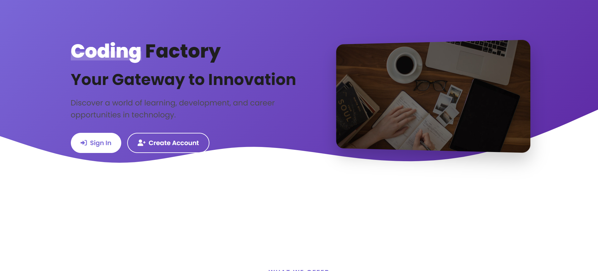

<div align="center">


# 🚀 Coding Factory Platform - Full-Stack Training Management System

<p align="center">
  
  
  
  
  
</p>

<h3>A Smart Training Center Platform with AI-Powered Recommendations and Intelligent Course Management</h3>
</div>

<p align="center">
  <a href="#overview">Overview</a> •
  <a href="#key-features">Features</a> •
  <a href="#architecture">Architecture</a> •
  <a href="#technologies">Technologies</a> •
  <a href="#directory-structure">Directory Structure</a> •
  <a href="#getting-started">Getting Started</a> •
  <a href="#module-details">Modules</a> •
  <a href="#faq">FAQ</a> •
  <a href="#team">Team</a> •
  <a href="#acknowledgments">Acknowledgments</a>
</p>

---

## 📋 Overview

<div align="center">
  
  <p><i>Coding Factory Platform - Landing Page</i></p>
</div>

**Coding Factory** is an innovative training center platform developed at **#Esprit_school_of_engineering** that suggests personalized training courses to users. Built with a modern **microservices architecture**, it helps students find the most relevant programming and technology courses based on their interests and career goals.

The platform's main role is to recommend appropriate trainings using **intelligent features** like **sentiment analysis** on course reviews. It also manages users, events, evaluations, consulting services, and final projects (PFE - Final Year Project) to provide a complete educational experience.

This project was developed as part of the curriculum at **Esprit School of Engineering** to create a full-stack application that demonstrates real-world software engineering practices and emerging technologies in AI and web development.

## ✨ Key Features

<div align="center">
  <table>
    <tr>
      <td align="center" width="33%">
        <br/>
        <b>User Management</b><br/>
        Authentication, role-based access control, and profile management
      </td>
      <td align="center" width="33%">
        <br/>
        <b>Training Center</b><br/>
        Course suggestions, enrollment, and intelligent recommendations
      </td>
      <td align="center" width="33%">
        <br/>
        <b>Event Management</b><br/>
        Organization, registration, and participant tracking
      </td>
    </tr>
    <tr>
      <td align="center">
        <br/>
        <b>Evaluation System</b><br/>
        Assessment creation, grading, and performance analytics
      </td>
      <td align="center">
        <br/>
        <b>Consulting Services</b><br/>
        Appointment scheduling and session tracking
      </td>
      <td align="center">
        <br/>
        <b>PFE Space</b><br/>
        Project management with AI-powered tools
      </td>
    </tr>
  </table>
</div>

### 🤖 AI-Powered Features

- **CV Analysis & Project Matching** - Automatically match students to projects based on skills
- **Cover Letter Generation** - AI-generated personalized cover letters
- **Plagiarism Detection** - Ensure originality in student submissions
- **AI Chatbot** - Intelligent assistant for project-related questions

## 🏗️ Architecture

<div align="center">
  
</div>

The platform follows a microservices architecture for scalability and maintainability:

<div align="center">
  <table>
    <tr>
      <td align="center" width="33%" style="background-color: #f8f9fa; padding: 15px; border-radius: 10px;">
        <h3>🌐 Gateway Layer</h3>
        <ul align="left">
          <li>API Gateway</li>
          <li>Eureka Service Discovery</li>
          <li>Config Server</li>
        </ul>
      </td>
      <td align="center" width="33%" style="background-color: #f8f9fa; padding: 15px; border-radius: 10px;">
        <h3>🔧 Core Services</h3>
        <ul align="left">
          <li>User Service</li>
          <li>Training Service</li>
          <li>Event Service</li>
          <li>PFE Service</li>
        </ul>
      </td>
      <td align="center" width="33%" style="background-color: #f8f9fa; padding: 15px; border-radius: 10px;">
        <h3>🧠 Intelligence Layer</h3>
        <ul align="left">
          <li>Sentiment Analysis</li>
          <li>AI Service</li>
          <li>Recommendation Engine</li>
        </ul>
      </td>
    </tr>
  </table>
</div>

## 🛠️ Technologies

<div align="center">
  <table>
    <tr>
      <td align="center" width="50%" style="padding: 20px;">
        <h3>🔙 Backend</h3>
        <p align="center">
          
          
          
          
          
        </p>
        <ul align="left">
          <li><b>Spring Boot</b> - Core framework for microservices</li>
          <li><b>Spring Security</b> - Authentication and authorization</li>
          <li><b>Spring Cloud</b> - Service discovery, configuration, and API gateway</li>
          <li><b>Spring Data JPA</b> - Database interaction</li>
          <li><b>PostgreSQL/MySQL</b> - Primary databases</li>
          <li><b>Docker</b> - Service containerization</li>
          <li><b>Hugging Face API</b> - AI models for NLP tasks</li>
          <li><b>Python Flask</b> - Sentiment analysis service</li>
        </ul>
      </td>
      <td align="center" width="50%" style="padding: 20px;">
        <h3>🖥️ Frontend</h3>
        <p align="center">
          
          
          
          
          
        </p>
        <ul align="left">
          <li><b>Angular</b> - Main frontend framework</li>
          <li><b>TypeScript</b> - Programming language</li>
          <li><b>Bootstrap</b> - Responsive UI components</li>
          <li><b>PrimeNG</b> - Advanced UI components</li>
          <li><b>RxJS</b> - Asynchronous data handling</li>
          <li><b>HTML5/CSS3</b> - Markup and styling</li>
        </ul>
      </td>
    </tr>
  </table>
</div>

## � Directory Structure

<div align="center">
  
</div>

```
CodingFactory-WebSite/
├── Backend/
│   ├── Microservices/
│   │   ├── ApiGateway/                # API Gateway service
│   │   ├── ConfigServer/              # Configuration server
│   │   ├── EurekaServer/              # Service discovery
│   │   ├── Gestion_Evenement/         # Event management service
│   │   ├── Gestion_Formation/         # Training management service
│   │   ├── Gestion_User/              # User management service
│   │   ├── PFESpace/                  # Final year project space service
│   │   └── SentimentAnalysis/         # Python sentiment analysis service
│   └── docker-compose.yml             # Docker configuration
├── Frontend/
│   └── coding_factory_front/
│       ├── src/
│       │   ├── app/
│       │   │   ├── components/        # Reusable UI components
│       │   │   ├── models/            # Data models and interfaces
│       │   │   ├── services/          # API services and business logic
│       │   │   ├── shared/            # Shared utilities and helpers
│       │   │   └── views/             # Page components
│       │   ├── assets/                # Static assets and images
│       │   └── environments/          # Environment configurations
│       └── package.json               # Frontend dependencies
└── README.md                          # Project documentation
```

## �🚀 Getting Started

<div align="center">
  
</div>

### Prerequisites

<table>
  <tr>
    <td>
      <ul>
        <li>☕ Java 17+</li>
        <li>📦 Node.js & Angular CLI</li>
      </ul>
    </td>
    <td>
      <ul>
        <li>🐳 Docker</li>
        <li>🗄️ PostgreSQL/MySQL</li>
      </ul>
    </td>
    <td>
      <ul>
        <li>🐍 Python 3.8+ (for sentiment analysis)</li>
        <li>📊 Maven</li>
      </ul>
    </td>
  </tr>
</table>

### Installation

<details>
<summary><b>🔧 Backend Setup</b></summary>
<br>

```bash
# Clone the repository
git clone https://github.com/your-username/coding-factory-platform.git

# Navigate to backend directory
cd Backend

# Build the project
mvn clean install

# Start the services
docker-compose up
```

> 💡 **Tip:** Make sure Docker is running before starting the services.
</details>

<details>
<summary><b>🖥️ Frontend Setup</b></summary>
<br>

```bash
# Navigate to frontend directory
cd Frontend/coding_factory_front

# Install dependencies
npm install

# Start the development server
ng serve
```

> 💡 **Tip:** The application will be available at http://localhost:4200
</details>

<details>
<summary><b>🧠 Sentiment Analysis Service Setup</b></summary>
<br>

```bash
# Navigate to sentiment analysis directory
cd Backend/Microservices/SentimentAnalysis

# Install dependencies
pip install -r requirements.txt

# Start the service
python sentiment_api.py
```

> 💡 **Tip:** The service will be available at http://localhost:5000
</details>

## 🔍 Module Details

<div class="module-cards" style="display: flex; flex-wrap: wrap; gap: 20px; justify-content: center;">
  <div style="flex: 1; min-width: 300px; border: 1px solid #e1e4e8; border-radius: 10px; padding: 20px; margin-bottom: 20px; background-color: #f6f8fa;">
    <h3>👤 User Management</h3>
    <hr style="border: 1px solid #e1e4e8;">
    <ul>
      <li><b>Authentication:</b> Secure login with JWT tokens</li>
      <li><b>Role Management:</b> Admin, Trainer, Student, Consultant</li>
      <li><b>Profile Settings:</b> Customizable user profiles</li>
      <li><b>Security:</b> Password encryption and account recovery</li>
    </ul>
    <div align="center">
      
    </div>
  </div>

  <div style="flex: 1; min-width: 300px; border: 1px solid #e1e4e8; border-radius: 10px; padding: 20px; margin-bottom: 20px; background-color: #f6f8fa;">
    <h3>📚 Training Center</h3>
    <hr style="border: 1px solid #e1e4e8;">
    <ul>
      <li><b>Course Suggestions:</b> Personalized training recommendations</li>
      <li><b>Enrollment:</b> Easy registration for suggested courses</li>
      <li><b>Smart Recommendations:</b> Based on sentiment analysis of reviews</li>
      <li><b>Comment Filtering:</b> Find the most positively reviewed trainings</li>
      <li><b>Career Path Guidance:</b> Courses aligned with career goals</li>
    </ul>
    <div align="center">
      
    </div>
  </div>

  <div style="flex: 1; min-width: 300px; border: 1px solid #e1e4e8; border-radius: 10px; padding: 20px; margin-bottom: 20px; background-color: #f6f8fa;">
    <h3>🎓 PFE Space</h3>
    <hr style="border: 1px solid #e1e4e8;">
    <ul>
      <li><b>Project Management:</b> Creation, assignment, and tracking</li>
      <li><b>AI Matching:</b> CV analysis and project matching with SBERT</li>
      <li><b>Document Generation:</b> AI-powered cover letter creation</li>
      <li><b>Plagiarism Detection:</b> Ensure originality in submissions</li>
      <li><b>AI Assistant:</b> Chatbot for project-related questions</li>
      <li><b>Admin Management:</b> Comprehensive admin dashboard for platform oversight</li>
    </ul>
    <div align="center">
      
    </div>
  </div>
</div>

## ❓ FAQ

<div align="center">
  
</div>

<details>
<summary><b>How does the recommendation system work?</b></summary>
<p>
The system uses sentiment analysis on training comments to prioritize courses with positive feedback. It employs either XGBoost or NLTK's VADER analyzer to classify comments and rank courses accordingly. This creates a personalized learning experience based on what other students have found most valuable.
</p>
</details>

<details>
<summary><b>Can I use the platform without the AI features?</b></summary>
<p>
Yes, all AI features are optional and the platform functions fully without them. They simply enhance the user experience when enabled. The core functionality of user management, training courses, and event organization works independently of the AI components.
</p>
</details>

<details>
<summary><b>How secure is the user data?</b></summary>
<p>
The platform implements Spring Security with JWT authentication, role-based access control, and secure password storage to protect user data. All sensitive information is encrypted, and the system follows industry best practices for data protection and privacy.
</p>
</details>

<details>
<summary><b>Is the platform mobile-friendly?</b></summary>
<p>
Yes, the Angular frontend is fully responsive and works on mobile devices, tablets, and desktops. Users can access all features from any device with a modern web browser.
</p>
</details>

<details>
<summary><b>What can administrators do in the platform?</b></summary>
<p>
Administrators manage the entire platform through a centralized dashboard. They handle user accounts, create and monitor training courses, manage events, oversee PFE projects, access analytics, and configure system settings. The admin dashboard provides quick access to all management functions.
</p>
</details>

## 👥 Team

<div align="center">
  <p>This project was developed by students from <b>4 SAE5</b>:</p>
  <p>
    <b>Ameni Zoubeir</b> •
    <b>Mohamed Amine Kalai</b> •
    <b>Mouna Chokri</b> •
    <b>Ons Fendouli</b> •
    <b>Belkis Sekri</b> •
    <b>Mootaz Chouchene</b>
  </p>
</div>

## 📞 Contact

<div align="center">
  <p>You can reach us through our GitHub accounts.</p>
</div>

## 🙏 Acknowledgments

<div align="center">
  <p>This project was completed under the guidance of professors at <b>Esprit School of Engineering</b>.</p>
  <p>Special thanks to all mentors and advisors who contributed to the success of this project.</p>
</div>

<div align="center">
  <sub>Built with ❤️ by the Coding Factory Team 4SAE5</sub>
</div>